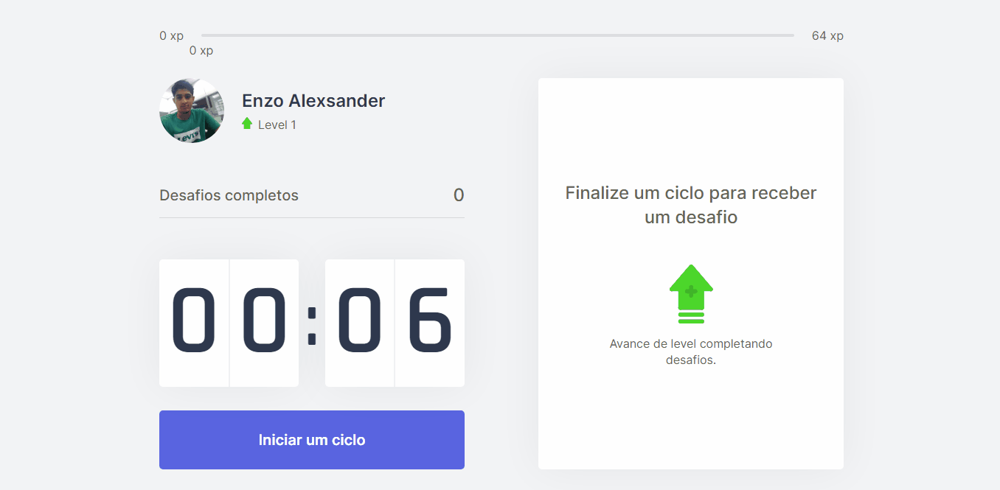

 

 

    
    <h1><i>Come on Dev</i></h1>

  

## 📕 About

Come on Dev app was developed during NLW # 04 - ReactJS Trail - Rocketseat.

It is a pomodoro for studies that at the end of the 25 minutes offers a challenge during the minutes of rest. Each challenge has an amount of points. If the challenge is carried out, the user gains the points and goes up the level.
  

## 💻 Preview

    

  

## 🔨 Tools

-   [ ] HTML
-   [ ] CSS
-   [ ] JavaScript
-   [ ] ReactJS
-   [ ] NextJS
  

## 🙋🏽‍♂️ Author

### Enzo Alexsander